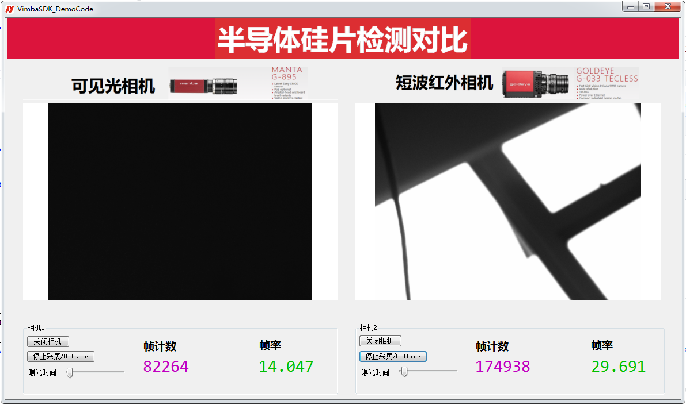

dotnet_two_cameras_comparison: Vimba .NET SDK sample for two cameras in free run mode
---
## Vimba SDK sample with two cameras in free run mode.

## Summary
* 封装Camera对象，便于直接调用
* 按IP地址/ID打开相机
* 触发设置
* 曝光设置
* 两个相机
